# Phase Portraits of Play

Interactive pictures of **learning dynamics in games**: what happens when every player
follows its own *first-order signal*, the gradient of its own expected payoff with
respect to its own strategy. The joint behaviour becomes a flow in strategy space;
this repository draws that flow for sender-receiver **signaling games**, classic
**normal-form games** and **Bertrand/Cournot markets**, as static figures and as
interactive pages.

<picture>
  <source media="(prefers-color-scheme: dark)" srcset="docs/figures/signaling_swarm_dark.gif">
  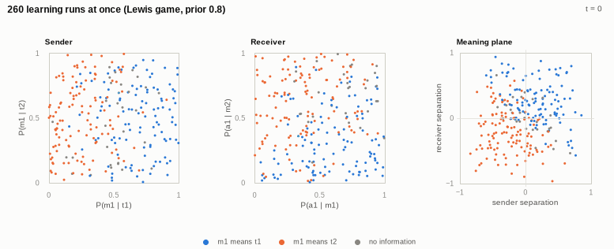
</picture>

| Explorer | What you can do |
|---|---|
| [`docs/signaling.html`](docs/signaling.html) | Linked views of the 4-dimensional signaling flow: sender and receiver squares with the landscape each agent currently sees, the meaning plane, a states → messages → actions diagram, basin slices, 200 parallel runs. Drag starting points, change priors, learning rules and who learns faster. |
| [`docs/normal-form.html`](docs/normal-form.html) | Phase portraits of 2×2 games with particle flow, Nash equilibria, basins and click-to-launch runs; continuous vs discrete vs optimistic learning; a clickable atlas of all symmetric 2×2 games; editable payoffs. |
| [`docs/simplex.html`](docs/simplex.html) | Three-strategy population games on the triangle (rock-paper-scissors in three flavours, coordination, Hawk-Dove-Bourgeois, repeated Prisoner's Dilemma), editable 3×3 payoffs. |
| [`docs/markets.html`](docs/markets.html) | Price plane of a logit or linear Bertrand duopoly (or Cournot quantities): best replies, Nash vs cartel, the "both gain" lens, gradient play vs alternating best replies, a sympathy parameter; animated Edgeworth price cycles; Q-learning firms trained live in the browser, with a one-off price cut to show punishment. |

**Run the pages locally:** `python3 -m http.server 8000 --directory docs` and open
<http://localhost:8000>. (They are ES modules, so opening the files directly from disk
will not work.) **Publish them:** in the repository settings, *Pages → Deploy from a
branch → `main` / `docs`*; the site then lives at `https://phierhager.github.io/game_vis/`.

---

## What "everyone follows the first-order signal" means here

Each player holds a mixed strategy and moves it along the gradient of its own
expected payoff, holding everyone else fixed. Nobody models anybody; each player just
reads its local signal. The rules differ only in how that signal becomes a step:

| rule | continuous time | the learning algorithm behind it |
|---|---|---|
| replicator | `ẋᵢ = xᵢ (gᵢ − x·g)` | multiplicative weights / Hedge |
| projected gradient | `ẋ = Π(g)` (projected onto the simplex) | projected gradient ascent |
| softmax policy gradient | `ẋ = J J g`, `J = diag(x) − x xᵀ` | policy gradient on logits |
| logit response *(contrast)* | `ẋ = softmax(g/τ) − x` | smoothed fictitious play |

`g` is the player's payoff vector, which for a player whose payoff is linear in its own
strategy is exactly the gradient. All rules live in [`src/gamevis/simplex.py`](src/gamevis/simplex.py)
and, identically, in [`docs/js/lib/simplex.js`](docs/js/lib/simplex.js).

## Signaling games: a genuine adaptive dynamical system

In a 2×2 normal-form game each player's strategy is one number, so the pair lives in a
unit square and the whole flow fits in one phase portrait. In a sender-receiver game
with two states, two messages and two actions the sender has one probability per state,
`P(m1 | t1)` and `P(m1 | t2)`, and the receiver one per message, `P(a1 | m1)` and
`P(a1 | m2)`. The state space is the 4-cube, and each agent's vector field depends on
where the other agent currently is. So yes, it is a genuine adaptive dynamical system,
and it needs more than one picture:

<picture>
  <source media="(prefers-color-scheme: dark)" srcset="docs/figures/signaling_squares_dark.png">
  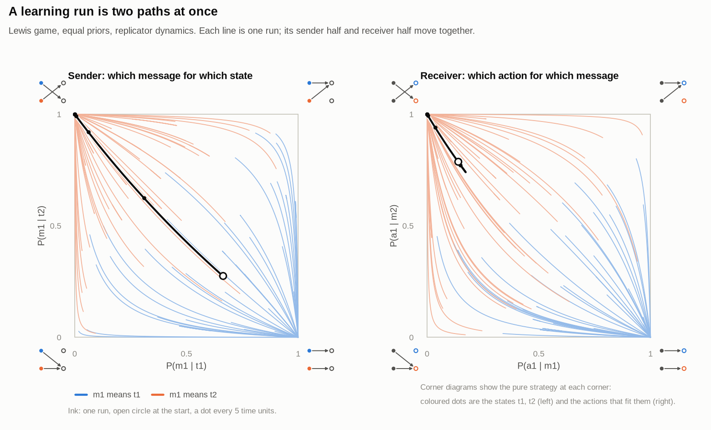
</picture>

**Two linked squares.** Each run is a *pair* of paths, one per agent. In the explorer
each square also shows the landscape its agent sees *right now*: each agent's payoff is
linear in its own strategy, so the landscape is a tilted plane, and it re-tilts as the
other agent learns.

The first-order signals (ex-ante gradients) are

```
dU_S / dP(m | t) = π(t) · [ Σ_a P(a | m) u_S(t, a) − c(t, m) ]
dU_R / dP(a | m) = P(m) · E[ u_R(t, a) | m ]
```

Two consequences shape everything below: rare states learn slowly, and **a message
nobody sends gives the receiver no signal at all** (`P(m) = 0`).

<picture>
  <source media="(prefers-color-scheme: dark)" srcset="docs/figures/meaning_plane_dark.png">
  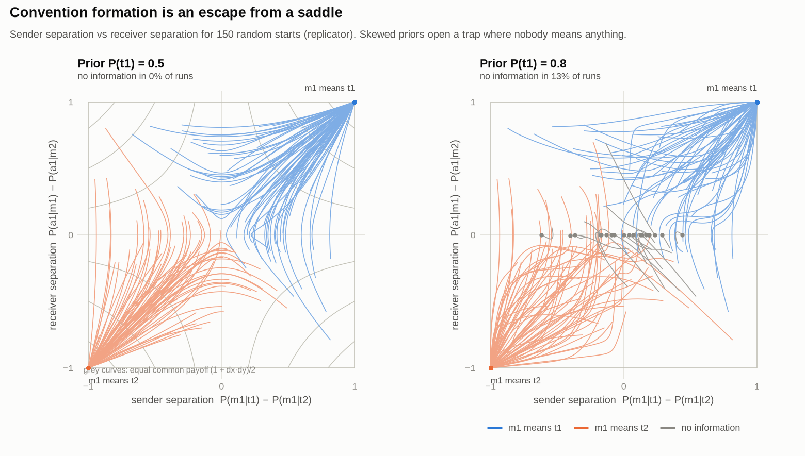
</picture>

**The meaning plane.** Project the 4-D flow onto *sender separation*
`P(m1|t1) − P(m1|t2)` and *receiver separation* `P(a1|m1) − P(a1|m2)`. With equal
priors the common payoff is exactly `(1 + dx·dy)/2`, a saddle, and under projected
gradient play the interior dynamics reduce exactly to the linear saddle
`dx' = dy/2, dy' = dx/2` (the two "bias" coordinates stay put). Convention formation is
escape from a saddle point, and which convention wins is symmetry breaking.

For common-interest games (Lewis) the three gradient rules are gradient-like flows of
the shared payoff, which acts as a potential: payoff never decreases along a run. With skewed
priors the receiver's bias drifts toward the likelier state's action; once it ignores
messages the sender's signal vanishes and the pair freezes: the **pooling trap**.

<picture>
  <source media="(prefers-color-scheme: dark)" srcset="docs/figures/pooling_trap_dark.png">
  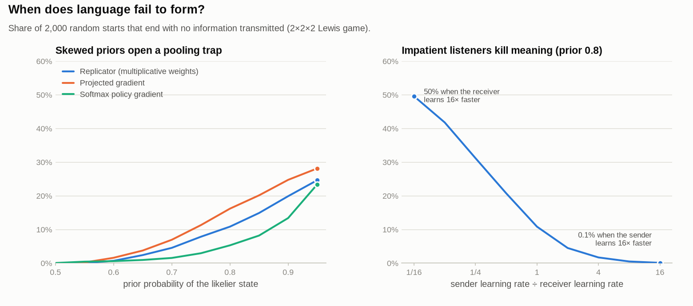
</picture>

<picture>
  <source media="(prefers-color-scheme: dark)" srcset="docs/figures/basin_slices_dark.png">
  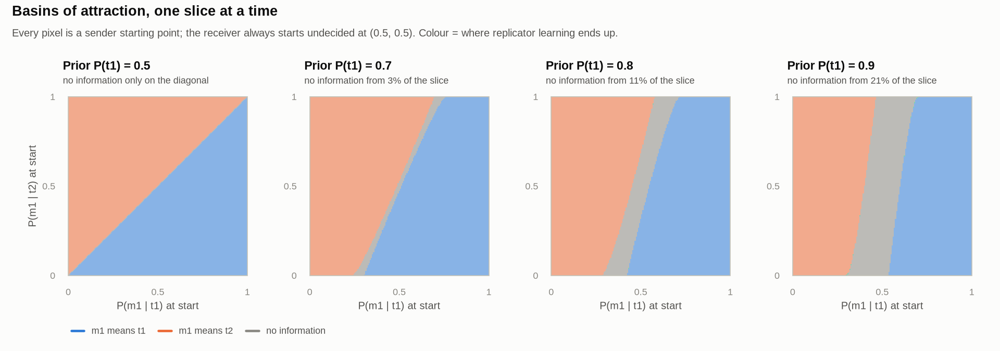
</picture>

**Conflicting interests: cycles.** In a handicap (costly signaling) game both sender
types want the reward and only the high type deserves it. If a display costs the low
type less than the reward, there is no stable honest equilibrium: mimicry erodes trust,
lost trust stops mimicry, restored trust invites it again. The flow is no longer a
gradient flow and orbits close around a hybrid equilibrium. Raise the low type's cost
above the reward and honest signaling becomes stable.

<picture>
  <source media="(prefers-color-scheme: dark)" srcset="docs/figures/costly_cycles_dark.png">
  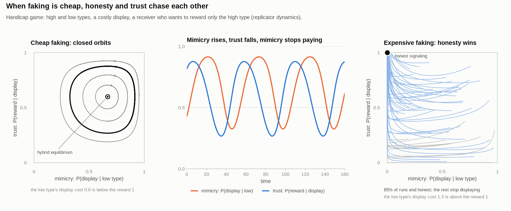
</picture>

**More states.** With three states the strategy space is 12-dimensional. Each state's
message mix is a dot in a triangle of messages, each message's action mix a dot in a
triangle of actions, and the whole configuration is a states → messages → actions flow
diagram. About one run in twenty ends in *partial pooling*, with two states sharing a
message.

<picture>
  <source media="(prefers-color-scheme: dark)" srcset="docs/figures/flow_filmstrip_dark.png">
  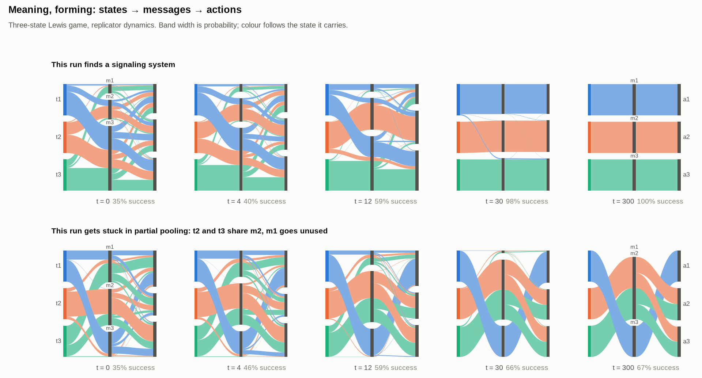
</picture>

<picture>
  <source media="(prefers-color-scheme: dark)" srcset="docs/figures/lewis3_triangles_dark.png">
  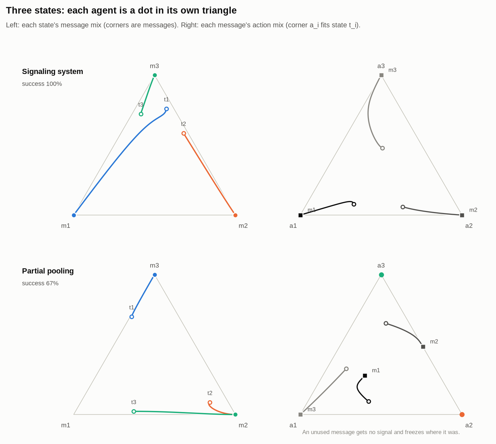
</picture>

### Numbers behind the pictures

Shares of uniformly random starting points (2,000 per cell, `sg.basin_fractions`),
2×2×2 Lewis game:

| prior of the likelier state | 0.5 | 0.6 | 0.7 | 0.8 | 0.9 |
|---|---|---|---|---|---|
| no language forms, replicator | 0% | 0.8% | 5.5% | 11% | 20% |
| no language forms, projected gradient | 0% | 1.8% | 7.4% | 17% | 26% |
| no language forms, softmax policy gradient¹ | 0.2% | 0.6% | 2.0% | 4.8% | 14% |

¹ Softmax policy gradient slows down near pure strategies, so a few runs are still on a
plateau at the end of the horizon (t = 2,000) and count as "no information".

At prior 0.8 (replicator) the pooling share is about 50% when the receiver learns
16× faster than the sender, 11% at equal speeds and under 1% when the sender is 16×
faster. A small exploration rate (0.005 toward uniform play) removes the trap entirely.
In the 3×3×3 game about 4.7% of replicator runs (5.9% projected gradient, 4.0% softmax
policy gradient) end in partial pooling. In the handicap game with cheap faking most
runs cycle and the rest stop displaying; with expensive faking about 85% end honest.

## Normal-form games

<picture>
  <source media="(prefers-color-scheme: dark)" srcset="docs/figures/normal_form_gallery_dark.png">
  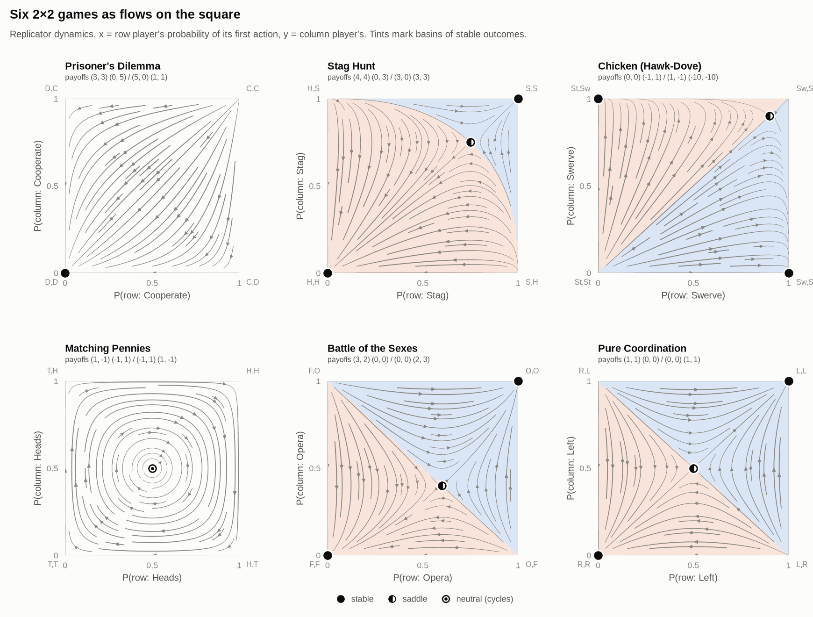
</picture>

Same signal, different clocks: in Matching Pennies continuous replicator orbits close,
multiplicative weights with a fixed step spirals out, the optimistic variant (feeding
`2g_t − g_{t−1}`) spirals in, and a smoothed best reply settles.

<picture>
  <source media="(prefers-color-scheme: dark)" srcset="docs/figures/discrete_vs_continuous_dark.png">
  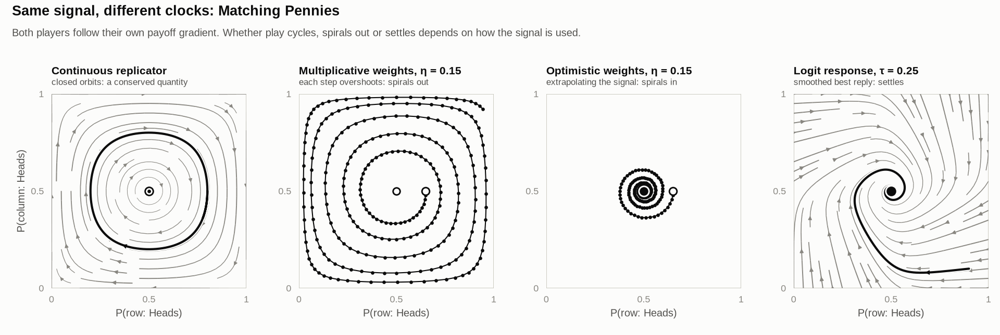
</picture>

<picture>
  <source media="(prefers-color-scheme: dark)" srcset="docs/figures/game_atlas_dark.png">
  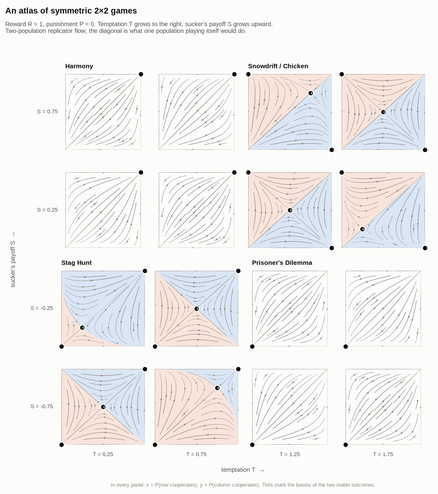
</picture>

<picture>
  <source media="(prefers-color-scheme: dark)" srcset="docs/figures/simplex_gallery_dark.png">
  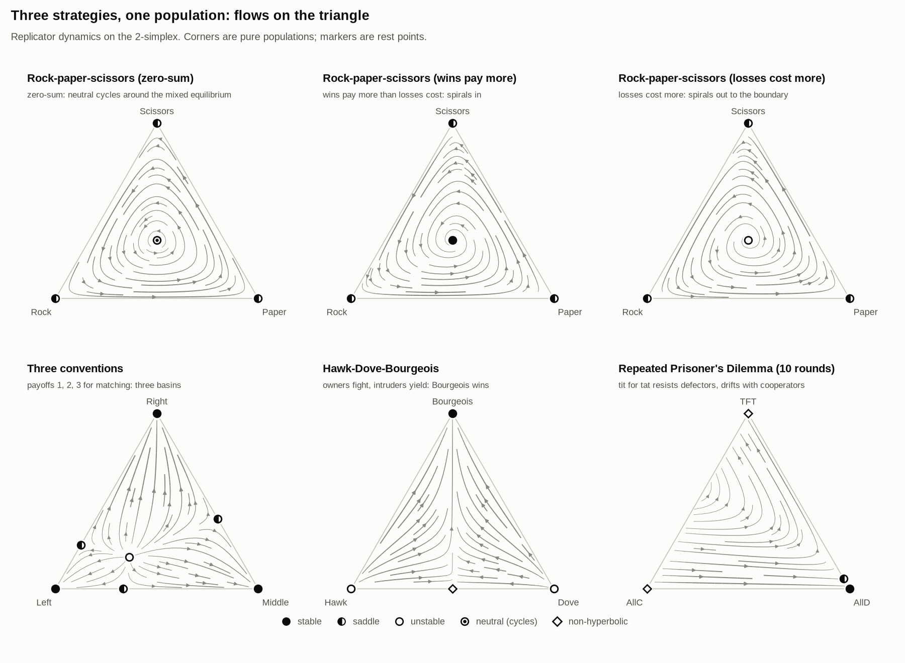
</picture>

## Markets

A firm's first-order signal is its marginal profit. Following it leads a Bertrand
duopoly to the Nash prices, never to the cartel, even though both firms would earn more
inside the lens above Nash. Giving each firm weight λ on its rival's profit moves the
rest point along the diagonal to the cartel. With logit demand at the Calvano et al.
(2020) baseline the Nash price is 1.473 and the cartel price 1.925.

<picture>
  <source media="(prefers-color-scheme: dark)" srcset="docs/figures/bertrand_plane_dark.png">
  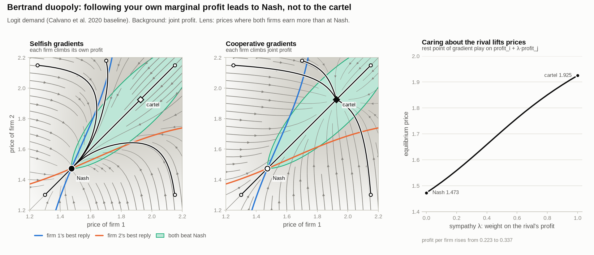
</picture>

With identical goods and capacity limits, best replies undercut until serving the
leftover demand at a high price pays more, then jump back up: an Edgeworth cycle with no
rest point.

<picture>
  <source media="(prefers-color-scheme: dark)" srcset="docs/figures/edgeworth_cycles_dark.png">
  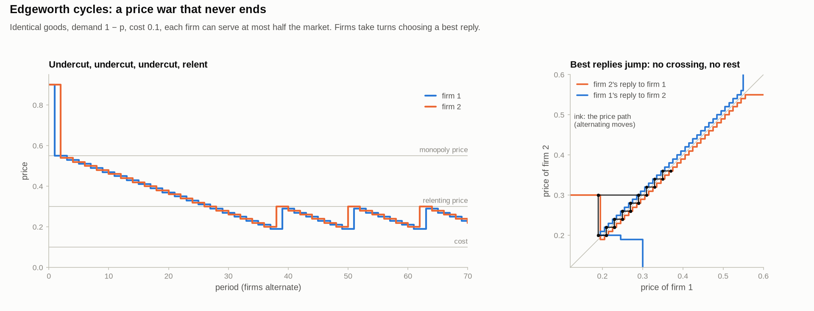
</picture>

For contrast, replace the gradient with a table. Tabular Q-learners that remember last
period's prices (the Calvano et al. 2020 baseline: 15 prices, 225 states, α = 0.15,
δ = 0.95, β = 4·10⁻⁶) usually settle well above Nash (average profit gain 83% of the way
from Nash to monopoly over 8 runs here, 84% over 12 runs in the browser version) and
answer a one-off price cut with a price war before returning to the high price. Memory
and punishment are exactly what the first-order signal lacks.

<picture>
  <source media="(prefers-color-scheme: dark)" srcset="docs/figures/qlearning_pricing_dark.png">
  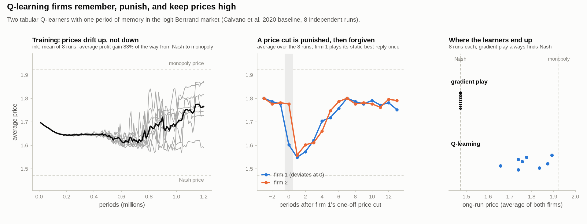
</picture>

## Using the Python package

```bash
pip install -e ".[dev]"
pytest                               # models, and parity with the JavaScript library
python scripts/make_figures.py       # regenerate docs/figures (light and dark)
python scripts/make_figures.py meaning_plane --theme light
python scripts/make_figures.py --gif # also the animated swarm
npm test                             # JavaScript library tests (node >= 20)
```

```python
import numpy as np
from gamevis import signaling as sg, normal_form as nf, markets as mk

game = sg.lewis(2, prior=0.8)
print(sg.basin_fractions(game, rule="replicator"))   # m1=t1, m1=t2, no information, cycling

X0 = np.random.default_rng(0).random((100, 4))      # 100 starts in the 4-cube
t, X = sg.simulate_binary(game, X0, "projection", t_max=200, rates=(1.0, 4.0))

sg.costly_signaling(cost_low=0.6)                   # handicap game with cheap faking
nf.BIMATRIX_PRESETS["matching_pennies"].discrete_path(0.7, 0.5, eta=0.15, optimistic=True)
mk.LogitBertrand().nash(), mk.LogitBertrand().collusive()

from gamevis.qlearning import QPricing
qp = QPricing(beta=1e-4)                             # fast exploration decay
res = qp.run(sessions=4, periods=60_000)
[qp.cycle_profit_gain(res["Q"][k], int(res["state"][k])) for k in range(4)]
```

## Repository layout

```
src/gamevis/        Python package
  simplex.py          learning rules on simplices (and their discrete-time algorithms)
  dynamics.py         fixed-step integrators for tuples of simplices
  signaling.py        sender-receiver games, presets, outcomes, basins
  normal_form.py      2x2 bimatrix games and symmetric n-strategy games
  markets.py          logit/linear Bertrand, Cournot, Edgeworth
  qlearning.py        tabular Q-learning pricing agents (the contrast case)
  plotting.py         matplotlib theme and drawing helpers
scripts/make_figures.py   the figure gallery
docs/               static site (GitHub Pages ready, no build step)
  js/lib/             the same models in JavaScript
  js/ui/              canvas plotting, particle flow, charts, theme
  js/pages/           one script per explorer
  figures/            generated figures (light and dark)
tests/              pytest suite, node tests, Python/JavaScript parity test
```

## Conventions worth knowing

* **Ex-ante gradients.** The sender's signal for state `t` is weighted by `π(t)`, the
  receiver's for message `m` by `P(m)`. This is the agent-form replicator dynamics; the
  interim alternative (dividing by `π(t)` and `P(m)`) only rescales time per agent
  but is undefined for unused messages.
* **Learning-rate ratio.** "Who learns faster" multiplies the sender's rate by `√r` and
  the receiver's by `1/√r`.
* **Outcome classes** for 2×2×2 runs use the tail of each run in the meaning plane:
  both separations near ±1 is a signaling system, either separation near 0 is no
  information, anything still swinging is cycling.

## References

* D. Lewis (1969). *Convention*. Harvard University Press.
* B. Skyrms (2010). *Signals: Evolution, Learning, and Information*. Oxford University Press.
* S. Huttegger (2007). Evolution and the explanation of meaning. *Philosophy of Science* 74(1).
* S. Huttegger, B. Skyrms, R. Smead, K. Zollman (2010). Evolutionary dynamics of Lewis signaling games: signaling systems vs. partial pooling. *Synthese* 172.
* J. Hofbauer, S. Huttegger (2008). Feasibility of communication in binary signaling games. *Journal of Theoretical Biology* 254.
* E. Wagner (2013). The dynamics of costly signaling. *Games* 4(2).
* J. Hofbauer, K. Sigmund (1998). *Evolutionary Games and Population Dynamics*. Cambridge University Press.
* W. Sandholm (2010). *Population Games and Evolutionary Dynamics*. MIT Press.
* J. Bailey, G. Piliouras (2018). Multiplicative weights update in zero-sum games. *EC '18*.
* C. Daskalakis, A. Ilyas, V. Syrgkanis, H. Zeng (2018). Training GANs with optimism. *ICLR*.
* E. Calvano, G. Calzolari, V. Denicolò, S. Pastorello (2020). Artificial intelligence, algorithmic pricing, and collusion. *American Economic Review* 110(10).
* E. Maskin, J. Tirole (1988). A theory of dynamic oligopoly II: price competition, kinked demand curves, and Edgeworth cycles. *Econometrica* 56(3).
